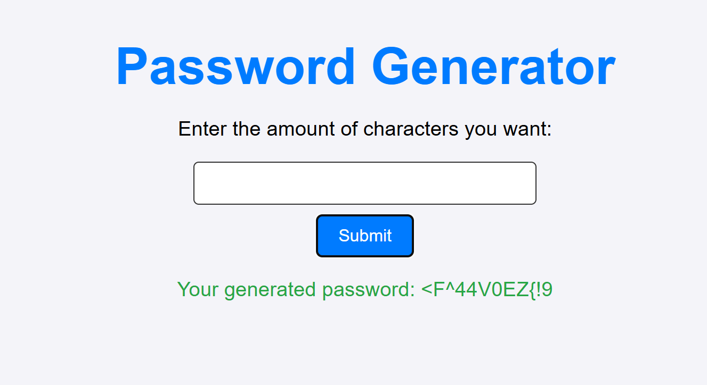

# Password_Generator
Ein einfacher Passwort-Generator, der sichere Passwörter erstellt. Dieses Projekt kombiniert ein Flask-Backend mit einem HTML/CSS/JavaScript-Frontend. <br>

# Anforderungen
Installierte Abhängigkeiten:
```
pip install flask
pip install flask_cors
```
# Autor
Erstellt von Sandro Schmid 
